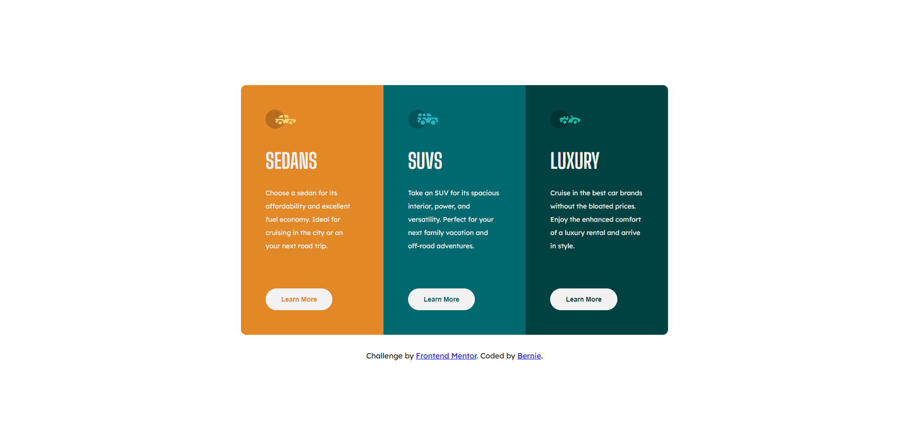

# Frontend Mentor - 3-column preview card component solution

This is a solution to the [3-column preview card component challenge on Frontend Mentor](https://www.frontendmentor.io/challenges/3column-preview-card-component-pH92eAR2-). Frontend Mentor challenges help you improve your coding skills by building realistic projects.

## Table of contents

- [Overview](#overview)
  - [The challenge](#the-challenge)
  - [Screenshot](#screenshot)
  - [Links](#links)
- [My process](#my-process)
  - [What I learned](#what-i-learned)
  - [Continued development](#continued-development)
  - [Useful resources](#useful-resources)
- [Author](#author)

## Overview

### The challenge

Users should be able to:

- View the optimal layout depending on their device's screen size
- See hover states for interactive elements

### Screenshot

### Links

- Live Site URL: [3-column-preview-card-component]((https://softpillow20.github.io/3-column-preview-card/))

## My process

### Built with

- Semantic HTML5 markup
- CSS custom properties
- CSS Grid
- Desktop-first workflow

### What I learned

I took off coding in HTML and CSS for about a year so I have to re-learn all of it again from scratch. I took a course last month and finished it last week. This is my first writing code without coding along with a course teacher. I applied some of the best practices that I've learned throughout that course and made sure that I created this website at the best of my abilities. I feel like I coded this website better than I did last year. Props goes to Jonas Schmedtmann for the course he made about HTML and CSS (not sponsored btw) and I've learned a lot from him just from that course.

### Continued development

I want to be consistent in the development space and develop my skills in creating beautiful looking websites that functions well. Less code means better performance which forces my code into reusability. I want to continue developing some, if not all the best practices in creating websites. While I practice my HTML and CSS skills, I will start touching some fundamentals of Javascript.

### Useful resources

- [Build Responsive Real-World Websites with HTML and CSS](https://www.udemy.com/course/design-and-develop-a-killer-website-with-html5-and-css3) - This is the course that helped me solidify my HTML and CSS skills. Jonas focuses on the fundamentals and the best practices in writing HTML and CSS. This course also have the fundamentals of web design and it's rules. I believe I'll be able to use the web design rules and framework in one of the components of his course. This'll be useful if your planning to be a freelancer as a frontend/website developer.

- [HTML & CSS Full Course - Beginner to Pro](https://youtu.be/G3e-cpL7ofc?si=xnVj5z6O8nM68ZgS) - This youtube course from supersimpledev is the course that I took last year. I learned a lot from him when I was just starting to learn HTML and CSS. This course is also great if you don't want to / can't afford Jonas' course on Udemy.

## Author

- Frontend Mentor - [@SoftPillow20](https://www.frontendmentor.io/profile/yourusername)
